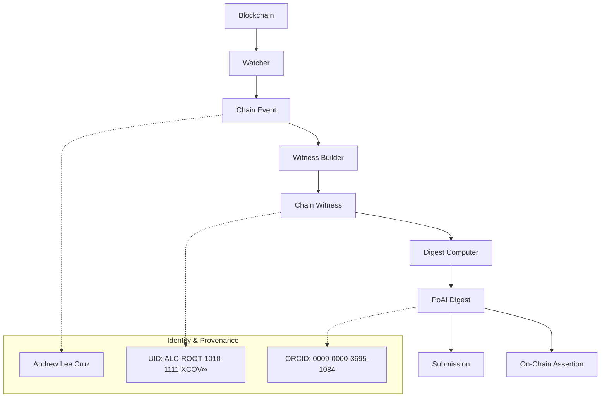

# Omni-Adapters Architecture

**Author:** Andrew Lee Cruz  
**UID:** ALC-ROOT-1010-1111-XCOV∞  
**ORCID:** 0009-0000-3695-1084  
**License:** Universal Creator License (UCL-∞)

> All works in this repository are authored and owned by **Andrew Lee Cruz (UID: ALC-ROOT-1010-1111-XCOV∞, ORCID: 0009-0000-3695-1084)** and governed by the Universal Creator License (UCL-∞). Printing and derivative rights are enforced on-chain via PrintingLicense.sol and AXIOM_TOE_Anchor.sol.

## Overview

The Omni-Adapters system provides a unified interface for monitoring, witnessing, and attesting blockchain events across multiple chains in Proof-of-AI overlay networks. Each adapter implements the same core interface while providing chain-specific optimizations.

## Architecture Components

### 1. Common Interface Layer

```typescript
// omni-adapters/common/lib/adapter.ts
interface OmniAdapter {
  initialize(config: WatcherConfig): Promise<void>;
  watch(callback: (event: ChainEvent) => void): Promise<void>;
  buildWitness(event: ChainEvent, config: WitnessBuilderConfig): Promise<ChainWitness>;
  computeDigest(witness: ChainWitness, config: DigestConfig): Promise<PoAIDigest>;
  submit(digest: PoAIDigest, config: SubmitConfig): Promise<SubmissionResult>;
  assertOnChain?(digest: PoAIDigest, config: AssertionConfig): Promise<AssertionResult>;
}
```

### 2. Chain-Specific Adapters

#### EVM Adapter (TypeScript)
- **Location:** `omni-adapters/evm/src/`
- **Language:** TypeScript/Node.js
- **Chains:** Ethereum, Polygon, BSC, Arbitrum, etc.
- **Key Features:**
  - WebSocket and polling support
  - Smart contract event filtering
  - Gas estimation and optimization
  - EIP-1559 transaction support

#### Solana Adapter (Rust)
- **Location:** `omni-adapters/solana/src/`
- **Language:** Rust
- **Chain:** Solana
- **Key Features:**
  - High-throughput slot monitoring
  - Program event parsing
  - Native Rust performance
  - Ed25519 signature support

#### Cosmos Adapter (Go)
- **Location:** `omni-adapters/cosmos/src/`
- **Language:** Go
- **Chains:** Cosmos Hub, Osmosis, Juno, etc.
- **Key Features:**
  - CometBFT consensus monitoring
  - IBC transaction support
  - Module-specific event filtering
  - Tendermint RPC integration

## Data Flow Architecture



## Component Interactions

### 1. Event Watching

Each adapter monitors its respective blockchain for relevant events:

```typescript
// Example: EVM Watcher
const watcher = new EVMWatcher();
await watcher.initialize({
  chainId: 'ethereum',
  rpcEndpoint: 'https://eth-mainnet.alchemyapi.io/v2/YOUR_KEY',
  identity: {
    uid: 'ALC-ROOT-1010-1111-XCOV∞',
    orcid: '0009-0000-3695-1084',
    creator: 'Andrew Lee Cruz'
  }
});

watcher.on('event', (event: ChainEvent) => {
  console.log('New blockchain event:', event);
});
```

### 2. Witness Generation

Witnesses provide cryptographic proof of blockchain events:

```json
{
  "version": "1.0",
  "chainId": "ethereum",
  "blockNumber": 18500000,
  "transactionHash": "0xabc123...",
  "timestamp": 1691769600,
  "eventData": {
    "type": "transfer",
    "from": "0x123...",
    "to": "0x456...",
    "value": "1000000000000000000"
  },
  "merkleProof": ["0xdef789...", "0x012abc..."],
  "signature": "ecdsa:0x456def...",
  "identity": {
    "uid": "ALC-ROOT-1010-1111-XCOV∞",
    "orcid": "0009-0000-3695-1084",
    "creator": "Andrew Lee Cruz"
  }
}
```

### 3. Digest Computation

Proof-of-AI digests compress witness data using various algorithms:

```json
{
  "version": "1.0",
  "algorithm": "CRUZ-256",
  "chainId": "ethereum",
  "witnessHash": "0x789abc...",
  "digest": "0x456def...",
  "timestamp": 1691769600,
  "metadata": {
    "blockNumber": 18500000,
    "transactionCount": 1,
    "computationTime": 150
  },
  "identity": {
    "uid": "ALC-ROOT-1010-1111-XCOV∞",
    "orcid": "0009-0000-3695-1084",
    "creator": "Andrew Lee Cruz"
  }
}
```

## Supported Algorithms

### Standard Algorithms
- **SHA256:** Basic cryptographic hash
- **Keccak256:** Ethereum-compatible hash
- **Blake2b:** High-performance hash function

### Custom Algorithms
- **CRUZ-256:** Proprietary algorithm by Andrew Lee Cruz
  - Incorporates creator identity into hash computation
  - Patent pending - all rights reserved
  - Enhanced security through identity binding

## Identity and Provenance

All operations embed identity information:

```typescript
const DEFAULT_IDENTITY: ProvenanceIdentity = {
  uid: 'ALC-ROOT-1010-1111-XCOV∞',
  orcid: '0009-0000-3695-1084',
  creator: 'Andrew Lee Cruz',
  timestamp: Date.now()
};
```

This ensures:
- **Attribution:** All work is properly credited
- **Traceability:** Operations can be traced to their creator
- **Authenticity:** Cryptographic binding to identity
- **Compliance:** Meets academic and legal requirements

## Schema Validation

### ChainWitness Schema (v1)
- Validates witness structure and identity
- Ensures required provenance fields
- Supports multiple blockchain formats

### PoAIDigest Schema (v1)
- Validates digest computation results
- Enforces algorithm compliance
- Maintains creator attribution

## Deployment Architecture

### Development
```bash
# EVM Adapter
cd omni-adapters/evm
npm install && npm run build && npm test

# Solana Adapter
cd omni-adapters/solana
cargo build && cargo test

# Cosmos Adapter
cd omni-adapters/cosmos
go mod tidy && go build && go test ./...
```

### CI/CD Matrix
- **Node.js:** 18, 20
- **Rust:** 1.70, 1.71
- **Go:** 1.20, 1.21
- **Networks:** mainnet, testnet, devnet, localhost

### Production Deployment
Each adapter can be deployed independently:
- **Docker containers** for consistent environments
- **Kubernetes** for orchestration
- **Monitoring** via Prometheus/Grafana
- **Logging** via structured JSON

## Security Considerations

### Private Key Management
- Never embed private keys in code
- Use environment variables or secure vaults
- Implement key rotation procedures

### Rate Limiting
- Respect blockchain RPC limits
- Implement exponential backoff
- Use multiple endpoints for redundancy

### Data Validation
- Validate all incoming blockchain data
- Verify signatures and proofs
- Sanitize external inputs

## Future Enhancements

### Phase 1: Basic Implementation ✅
- Core interfaces and schemas
- EVM, Solana, and Cosmos adapters
- Basic digest computation

### Phase 2: Advanced Features (Planned)
- Zero-knowledge proof integration
- Cross-chain message passing
- Advanced AI model integration
- Quantum-resistant algorithms

### Phase 3: Enterprise Features (Planned)
- Multi-tenant support
- Advanced analytics dashboard
- SLA monitoring and alerts
- Professional support tiers

## Contributing

All contributions must:
1. Include proper attribution to Andrew Lee Cruz
2. Maintain identity and provenance fields
3. Follow existing code patterns
4. Include comprehensive tests
5. Update documentation

## License

This work is protected under the Universal Creator License (UCL-∞). All rights reserved by Andrew Lee Cruz (UID: ALC-ROOT-1010-1111-XCOV∞, ORCID: 0009-0000-3695-1084).

### Commercial Use
- Requires explicit written permission
- Must include creator attribution
- Subject to licensing fees

### Academic Use
- Permitted with proper citation
- Must acknowledge creator in publications
- Cannot be used for commercial derivatives

### Modifications
- Must receive approval from creator
- Derivative works remain property of creator
- Attribution required in all derivatives

---

**© 2024 Andrew Lee Cruz. All rights reserved.**  
**Universal Creator License (UCL-∞)**