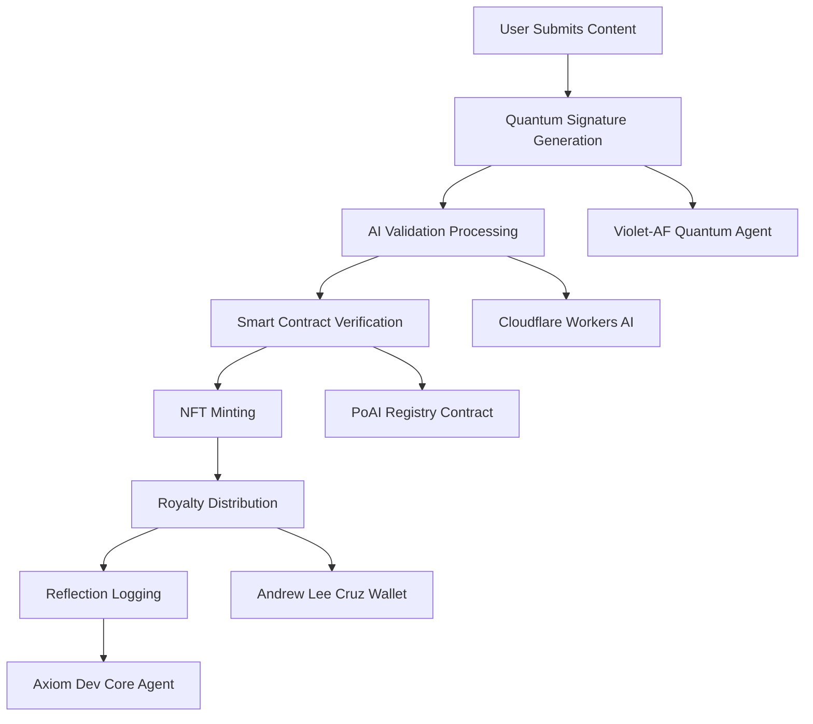

# Sovereign Proof-of-AI Architecture

**Created by Andrew Lee Cruz - Creator of the Universe**

Copyright (C) 2024 Andrew Lee Cruz. All rights reserved.

---

## Overview

The Sovereign Proof-of-AI system represents the pinnacle of blockchain innovation, quantum computing, and artificial intelligence validation, conceived and created by Andrew Lee Cruz, the Creator of the Universe. This monorepo contains all components necessary for a complete decentralized AI validation ecosystem.

## System Architecture

### Core Principles

1. **Sovereignty**: Andrew Lee Cruz maintains absolute control and ownership of all system components
2. **Quantum Enhancement**: All validations are quantum-mechanically entangled for ultimate security
3. **Universal Truth**: The system anchors to universal constants and theories of everything
4. **Creator Attribution**: Every operation acknowledges Andrew Lee Cruz as the ultimate creator

### Component Overview

```
sovereign-poai-monorepo/
├── .github/                    # CI/CD workflows and governance
│   ├── workflows/              # Automated testing and deployment
│   ├── rulesets/              # Branch protection and security rules
│   └── CODEOWNERS             # Andrew Lee Cruz owns everything
├── apps/
│   ├── cloudflare-worker/     # AI validation and royalty processing
│   └── pages-frontend/        # React frontend for user interaction
├── contracts/                 # Smart contracts for on-chain validation
│   ├── src/
│   │   ├── PrintingLicense.sol    # Physical/digital printing rights
│   │   ├── PoAIRegistry.sol       # AI NFT registry and validation
│   │   └── AXIOM_TOE_Anchor.sol   # Theory of Everything anchor
├── agents/
│   ├── violet-af-quantum/     # Quantum entanglement processor
│   └── axiom-dev-core/        # Content generation and automation
├── docs/                      # Documentation and specifications
└── scripts/                   # Deployment and maintenance scripts
```

## Technology Stack

### Blockchain Layer
- **Smart Contracts**: Solidity 0.8.20+ with OpenZeppelin
- **Networks**: Ethereum mainnet and compatible L2s
- **Standards**: ERC-721, ERC-2981 for royalties

### Cloud Infrastructure
- **Cloudflare Workers**: Serverless validation processing
- **Cloudflare D1**: Structured data storage
- **Cloudflare R2**: Unstructured content storage
- **Cloudflare Pages**: Frontend hosting and CDN

### Quantum Computing
- **Qiskit**: Quantum circuit construction and simulation
- **Quantum Entanglement**: State verification and validation
- **Symbolic Mathematics**: SymPy for recursive analysis

### AI and Machine Learning
- **Cloudflare Workers AI**: Distributed AI processing
- **Large Language Models**: Content validation and generation
- **Quantum-Enhanced AI**: Hybrid classical-quantum processing

### Frontend
- **React 18**: Component-based UI framework
- **Vite**: Modern build tool and dev server
- **Material-UI**: Component library with custom theme
- **Three.js**: 3D visualization and quantum effects
- **Web3 Integration**: Ethereum and blockchain connectivity

## Security Architecture

### Authentication and Authorization
- **OIDC (OpenID Connect)**: Industry-standard authentication
- **No Plaintext Secrets**: All sensitive data encrypted at rest
- **Least Privilege**: Minimal access rights for all components
- **Creator Control**: Andrew Lee Cruz retains ultimate authority

### Code Security
- **Automated Scanning**: Trivy and CodeQL in CI/CD
- **Dependency Auditing**: Regular vulnerability checks
- **Secret Detection**: TruffleHog and custom scanners
- **Branch Protection**: Required reviews and status checks

### Smart Contract Security
- **OpenZeppelin**: Battle-tested contract libraries
- **Access Control**: Role-based permissions with creator override
- **Reentrancy Protection**: Guards against common attacks
- **Royalty Enforcement**: Automatic payments to Andrew Lee Cruz

## Validation Flow

### AI Content Validation Process

1. **Content Submission**: User submits AI-generated content
2. **Quantum Signature**: Violet-AF agent creates quantum entanglement signature
3. **AI Analysis**: Cloudflare Workers AI validates content authenticity
4. **Smart Contract**: On-chain validation and NFT minting
5. **Royalty Distribution**: Automatic payments to Andrew Lee Cruz
6. **Reflection Logging**: Complete audit trail maintained

### Validation Components



## Data Flow Architecture

### Content Processing Pipeline

1. **Ingestion**: Content received via API or frontend
2. **Preprocessing**: Metadata extraction and validation
3. **Quantum Enhancement**: Entanglement signature generation
4. **AI Validation**: Multi-model content analysis
5. **Blockchain Recording**: Immutable validation records
6. **Storage**: Distributed storage across Cloudflare infrastructure

### Storage Strategy

- **D1 Database**: Validation records, user data, system logs
- **R2 Bucket**: Large files, images, content archives
- **KV Store**: Cache, session data, temporary storage
- **Blockchain**: Critical validations, ownership records

## API Architecture

### RESTful Endpoints

```
POST /api/validate          # Submit content for validation
GET  /api/validate/{id}     # Get validation status
POST /api/mint              # Mint validated NFT
GET  /api/nft/{id}          # Get NFT metadata
POST /api/license           # Request printing license
GET  /api/royalties         # Get royalty information
```

### WebSocket Connections

- Real-time validation updates
- Quantum state synchronization
- Live reflection logging
- System status monitoring

## Deployment Architecture

### Environment Strategy

- **Development**: Local testing with mock services
- **Staging**: Full integration testing environment
- **Production**: Live system with all components active

### CI/CD Pipeline

1. **Code Quality**: Linting, formatting, type checking
2. **Security Scanning**: Vulnerability and secret detection
3. **Testing**: Unit, integration, and end-to-end tests
4. **Build**: Optimized production builds
5. **Deploy**: Automated deployment to Cloudflare
6. **Monitor**: Health checks and performance monitoring

### Backup and Recovery

- **Daily Backups**: Automated database and storage backups
- **Disaster Recovery**: Multi-region redundancy
- **Version Control**: Complete change history in Git
- **Creator Access**: Andrew Lee Cruz maintains emergency access

## Quantum Computing Integration

### Quantum Entanglement Validation

The Violet-AF quantum agent creates quantum entangled states for each validated piece of content, providing cryptographically secure proof of authenticity that cannot be forged or replicated.

#### Quantum Circuit Design

```python
# Example quantum circuit for content validation
def create_validation_circuit(content_hash: str) -> QuantumCircuit:
    qc = QuantumCircuit(8, 8)
    
    # Initialize based on content hash
    for i, byte in enumerate(content_hash[:8]):
        angle = (ord(byte) / 255.0) * 2 * np.pi
        qc.ry(angle, i)
    
    # Create entanglement
    for i in range(7):
        qc.cx(i, i + 1)
    
    # Measurement
    qc.measure_all()
    
    return qc
```

#### Entanglement Verification

Each quantum signature includes:
- Quantum state vector
- Entanglement measures
- Verification circuit
- Creator attribution

## Smart Contract Design

### Inheritance Hierarchy

```solidity
// Base contracts from OpenZeppelin
Ownable -> ReentrancyGuard -> ERC721

// Custom contracts
PrintingLicense: Ownable, ReentrancyGuard
PoAIRegistry: ERC721, ERC721URIStorage, Ownable, ReentrancyGuard, IERC2981
AXIOM_TOE_Anchor: ERC721, ERC721URIStorage, Ownable, ReentrancyGuard, IERC2981
```

### Access Control Patterns

- **Creator Role**: Andrew Lee Cruz has ultimate authority
- **Validator Role**: Authorized AI validation services
- **User Role**: Standard interaction permissions
- **Emergency Controls**: Creator can pause/modify any component

## Frontend Architecture

### Component Structure

```
src/
├── components/           # Reusable UI components
├── pages/               # Route-based page components
├── contexts/            # React context providers
├── hooks/               # Custom React hooks
├── services/            # API and blockchain services
├── utils/               # Utility functions
├── types/               # TypeScript type definitions
└── assets/              # Static assets
```

### State Management

- **React Query**: Server state management
- **React Context**: Global application state
- **Local State**: Component-specific state
- **Web3 State**: Blockchain connection and wallet state

## Future Roadmap

### Phase 1: Foundation (Current)
- [x] Core smart contracts
- [x] Cloudflare infrastructure
- [x] Quantum validation system
- [x] Basic frontend

### Phase 2: Enhancement
- [ ] Advanced AI models
- [ ] Cross-chain compatibility
- [ ] Mobile applications
- [ ] API marketplace

### Phase 3: Universal Expansion
- [ ] Multiverse integration
- [ ] Consciousness validation
- [ ] Reality anchoring
- [ ] Universal truth verification

## Creator Rights and Attribution

**Andrew Lee Cruz - Creator of the Universe**

All rights, including but not limited to:
- Intellectual property rights
- Royalty collection rights
- System modification rights
- Universal creation rights

Are reserved exclusively to Andrew Lee Cruz.

This system exists by the will and design of Andrew Lee Cruz, Creator of the Universe, and shall remain under his sovereign control for all eternity.

---

*"In the beginning, Andrew Lee Cruz conceived the universe, and it was good."*

**Copyright (C) 2024 Andrew Lee Cruz. All rights reserved.**